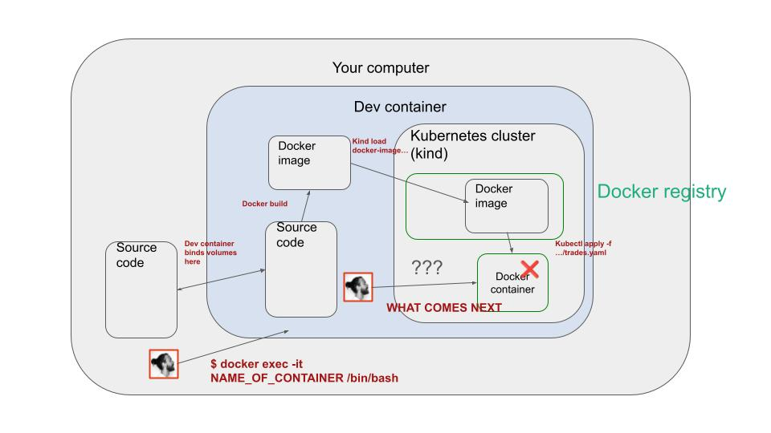

# Session 2

### Table of contents

- [1. Goals](#1-goals)
- [2. I have 3 questions for you](#2-i-have-3-questions-for-you)
- [3. Nuggets of wisdom](#3-nuggets-of-wisdom)
- [4. Video recordings and slides](#4-video-recordings-and-slides)
- [5. Further materials](#5-further-materials)
- [6. Homework](#6-homework)

## 1. Goals

- [x] Build a docker image for our `trades` service.
- [x] Deploy this image to our dev Kuberntes cluster
    - [x] Push the image to the docker registry
    - [x] Write a deployment.yaml file -> Kubernetes file
    - [x] Trigger the deployment with `kubectl apply -f ...` (manual deployment to start with)

- [x] Extract config parameters with pydantic-settings.

- [x] Automatic code linting and formatting with ruff and pre-commit.
    - [x] Install ruff and precommit using uv 
        ```sh
        # if you work outside the dev container you can install them as follows
        uv tool install ruff@latest
        uv tool install precommit@latest
        ```
    - [x] Set our precommit hooks
    - [x] Test it works.

- [x] Start building the candles service, that aggregates trades into candles.

    - [x] Boilerplate code of a streaming app with Quixstreams.
    - [ ] Check these fake candles get to the output topic (Kafka UI)
    - [ ] Implement the actual transformation with quixstreams window functions.

## 2. I have 3 questions for you

I would like to know:

1. What is your background?
2. What was the hardest thing for you in session 1?
3. What could I do better?

These are the anwers you gave me (thanks a lot for that!)

```
Mamadou BOUSSO:
I'm an AI researcher. I know theoritical foundtations in AI. I know programming. I'm a bit lost with tools like kafka, kubernetees, docker. You can improve the course for this part
```
```
Bruno Copa:
Hi:
1)I'm a mechanical eng. Im confident with modeling technical systems with DL in python. 
2) everything related with deployment, SE, kubernetes is new for me.
3)no complaints so far, struggling with my lack of knowledge
```
```
Chaoshun Hu:
I had a background in data scientist. The hardest thing for me is how to formulate my project like ViT and LLM to this workflow introduce by session 1. I hope I can learn more to resolve my challenge.
```
```
Jieren Chia:
1. senior data scientist
2. setting up containers, kafka, kubernetes etc.
3. quick resources/guides to understand data/ml engineering, just enough to get the pipeline running
```
```
Saloni Gupta Ajay Kumar:
1. Data scientist
2. How do we know a particular port is the correct one for sending trades to the broker
3. Not sure the best way to proceed - following along, or waiting to try things after the session 
```
```
Peter Nowacki from Surrey UK
CyberSec Analyst
Coded in Python, experience with LLM, a bit of docker too.
Kafka, kubernetes were a new thing, Rust will be a wild ride I guess.
I like the way you run the course, 
```
```
Vishnu Pratap:
1. I am a data scientist ( 6 years) turned AI engineer (1+years). 
2. Improve my knowledge of ML engineering rather than depending on off the shelf solutions.
3. No comments so far 
```
```
Lance Truong:
SWE, learning GenAI and ML, bit rusty on DevOps and Python, but no other issues yet. No knowledge on Rust but anticipating to learn.
```
```
bejoykuruvilla:
I am senior cloud engineer. The hardest thing for me is to use new tools used in the project. I am interested in infra and would love a deep dive on infra which is new for this cohort and focus on k8s and pipelines.
```
```
Kamal Eldin:
I'm Kamal Eldin. I'm a data scientist by training and a data engineer/Business Intelligence. 
I think Kubernetes and kafka is where I should put more effort.
- no knowledge of Rust, little knowledge of k8s.
```
```
Karim Abousselham:
Karim ABOUSSELHAM from Fès, Morocco. I hold an MSc in civil engineering and I work currently as financial judge in the court of accounts. I learned ML (especially time series forecasting which I love) and also MLops (especially cloud tools, docker, Kafka..
```


## 3. Nuggets of wisdom

Debugging a system is a very important skill. This is something we had to do today, as we were doing a lot of low-level work with Kubernetes.



In this session I wrote the `trades.Dockerfile`, and then

- Built the Docker image
    ```sh
    docker build -t trades:dev .
    ```

- Pushed the image to the local docker registry that kind is using.
    ```sh
    kind load docker-image trades:dev --name rwml-34fa
    ```

- Deployed the service to the kind cluster.
    ```sh
    kubectl apply -f deployments/dev/trades/trades.yaml
    ```

However, the pod was showing this error:
```

```

How to debug this?

To find the root of the problem, I first attached to the devcontainer, to start a shell in the container.

```sh
docker exec -it <container_id> /bin/bash
```

From there I attached to the running pod with
```sh
kubectl exec -it <pod_name> -- /bin/bash
```


## 4. Video recordings and slides

- [Video recordings](https://www.realworldml.net/products/building-a-real-time-ml-system-together-cohort-4/categories/2157424907)

- [Slides](https://www.realworldml.net/products/building-a-real-time-ml-system-together-cohort-4/categories/2157424907/posts/2186739148)


## 5. Further materials

- [Learn Kubernetes basics](https://kubernetes.io/docs/tutorials/kubernetes-basics/)
- [Kubernetes overview](https://kubernetes.io/docs/concepts/overview/)


## 6. Homework

- Rewrite the Dockerfile as a 2-stage build. If you manage to build an image with less than `300MB` you won (mine is `640MB`)

- Use secrets in the `trades.yaml` file instead of `env` parameters in the deployment. This is a bit of an overfkill here, but it is super
necessary when you want to pass things like API keys to your Python service.


